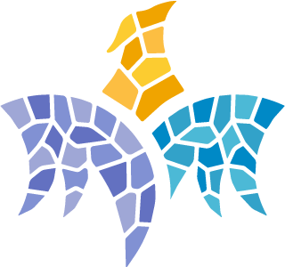

    "/>

 
<h1 align="center">MEEP Aurora DMA
 
 

# Description

It is a Aurora DMA project. The data acquisition and control applications are a substantial, exciting area to be analyzed. These applications are mainly based on networks of multi-Gigabit serial links. For instance, the High-speed serial communication will be analyzed more deeply with a transaction between memories on our Alveo cards. We are interested in testing how this high-speed serial communication's behavior could be if it is used for the transaction with two external memory (DDR, HBM,…)

## Features

Compatible with the Alveo cards (U280 and U55C).

## 🛠️ Usage

It is available a Makefile to generate an IP

    make generate_ip

It also have available to clean the project with:

    make clean

## - :woman: Authors

- Francelly Cano Ladino: francelly.canoladino@bsc.es
- Alex Kropotov: alex.kropotov@bsc.es

## 👷 Partners

**Barcelona Supercomputing Center** - Centro Nacional de Supercomputación (BSC-CNS) :globe_with_meridians:
[Website](https://www.bsc.es "Welcome")
 **University of Zagreb**, Faculty of Electrical Engineering and Computing
:globe_with_meridians: [Website](https://www.fer.unizg.hr/en "Welcome")
 **TÜBITAK BILGEM** Informatics and Information Security Research Center :globe_with_meridians: [Website](https://bilgem.tubitak.gov.tr/en "Welcome")

 
 

<h2 align="center">🤝 Support</h2>

The MEEP project has received funding from the European High-Performance Computing Joint Undertaking (JU) under grant agreement No 946002. The JU receives support from the European Union’s Horizon 2020 research and innovation programme in Spain, Croatia, Turkey.

